<!-- ============ HEADER ============ -->
<p align="center">
  
</p>

<p align="center">
  <a href="https://github.com/Prathmesh2007-16/Prathmesh2007-16">
    
  </a>
</p>

<p align="center">
  <a href="https://portfolio-five-lemon-47.vercel.app/"></a>
  <a href="https://www.linkedin.com/in/prathmesh-chaure-b38612335"></a>
  <a href="mailto:chaureprathmesh06@gmail.com"></a>
</p>

---

## 👨‍💻 About Me

```verilog
module prathmesh (
    input  wire        curiosity,
    input  wire        coffee,
    output reg  [2:0]  domains      // [VLSI, EMBEDDED, AI_ML]
);
    // 3rd year B.E. Electronics (VLSI Design & Technology)
    always @(posedge curiosity) begin
        domains <= 3'b111;          // learning all three, building in all three
    end
endmodule
```

- 🔬 **VLSI:** RTL design & verification, FPGA flow, simulation & waveform analysis
- 🤖 **Embedded Systems:** ESP32 / Arduino prototypes with sensors, actuators and real-time logic
- 🧠 **AI / ML:** Python, data analytics and building small ML + web projects
- 🎯 **Looking for:** VLSI / RTL design & verification internships
- 🌐 **Portfolio:** [portfolio-five-lemon-47.vercel.app](https://portfolio-five-lemon-47.vercel.app/)

---

## 🛠️ Tech Stack

**VLSI / EDA**


**Embedded**


**ML / Software**


---

## 🚀 Featured Projects

| Project | What it is | Stack | Repo |
|---|---|---|---|
| **PrivX** | Full-stack project: TypeScript app with a Python backend | `TypeScript` `Python` | [PrivX](https://github.com/Prathmesh2007-16/PrivX) · [backend](https://github.com/Prathmesh2007-16/privx-backend) · [app](https://github.com/Prathmesh2007-16/privx-app-2026) |
| **Banking System** | Python-based banking system mini project | `Python` | [Banking_System](https://github.com/Prathmesh2007-16/Banking_System) |
| **Portfolio Website** | My animated portfolio, live on the web | `HTML` `CSS` `JS` | [Code](https://github.com/Prathmesh2007-16/portfolio) · [Live](https://portfolio-five-lemon-47.vercel.app/) |
| **Traffic Light Controller (FSM)** | FSM-based controller verified through simulation and waveforms | `Verilog` `ModelSim` | 🔜 uploading soon |
| **16-bit ALU** | Multi-operation ALU verified with a dedicated testbench | `Verilog` `Testbench` | 🔜 uploading soon |
| **Obstacle Avoiding Car** | ESP32 prototype with obstacle sensors and motor control | `ESP32` `C++` | 🔜 uploading soon |
| **Smart Car Parking** | Arduino parking system that tracks availability with sensors | `Arduino` | 🔜 uploading soon |

> 📌 More projects are on the way. See all repositories → [github.com/Prathmesh2007-16](https://github.com/Prathmesh2007-16?tab=repositories)

---

## 🏆 Highlights

- 🥇 **Engineering Expo** winner (VESA, Dr. Vithalrao Vikhe Patil College of Engineering)
- 💼 **Internships & programs:** VLSI at UptoSkills · Machine Learning at CodeAlpha · Python with AI at EWB Courses · Data Analytics with AI (AICTE | IBM SkillsBuild)
- 🎓 **Course:** Complete ASIC Design Flow: VLSI From Idea to Silicon (45.5 hrs)

---

## 📊 GitHub Stats

<p align="center">
  
  
</p>

<p align="center">
  
</p>

---

## 🐍 Contribution Snake

<p align="center">
  
</p>

---

## 🤝 Let's Connect

I'm always up for talking about **VLSI, embedded systems and ML**: collaborations, internships or just ideas.

<p align="center">
  <a href="https://portfolio-five-lemon-47.vercel.app/"></a>
  <a href="https://www.linkedin.com/in/prathmesh-chaure-b38612335"></a>
  <a href="mailto:chaureprathmesh06@gmail.com"></a>
</p>

<p align="center">
  
</p>
